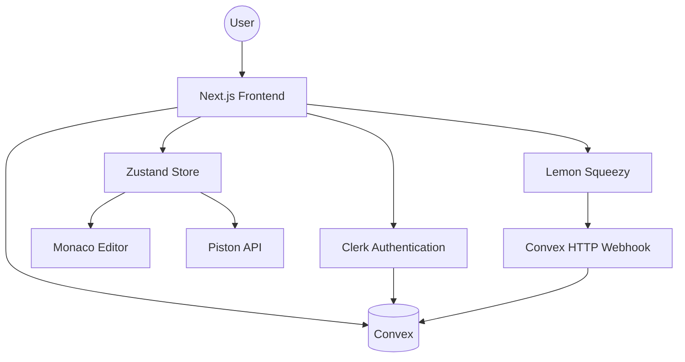
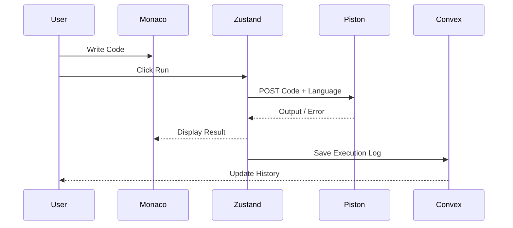
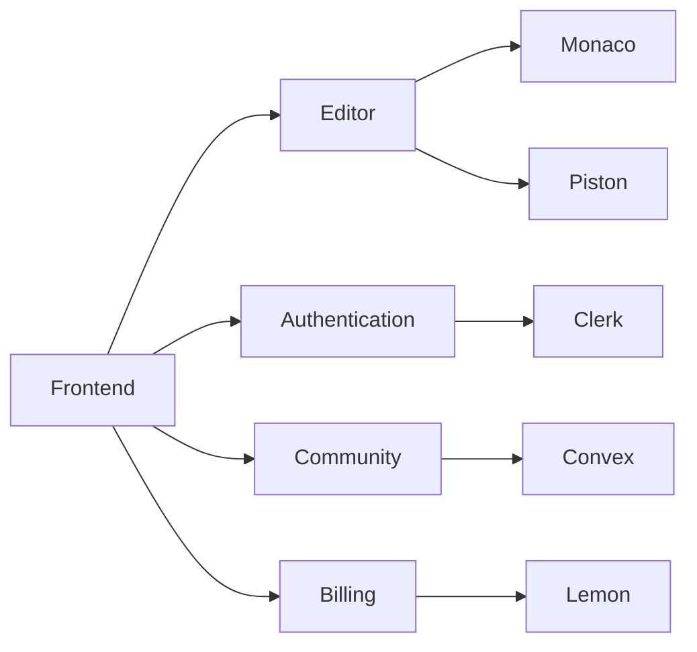
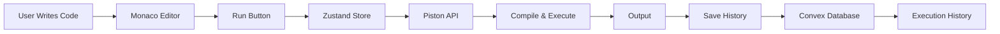
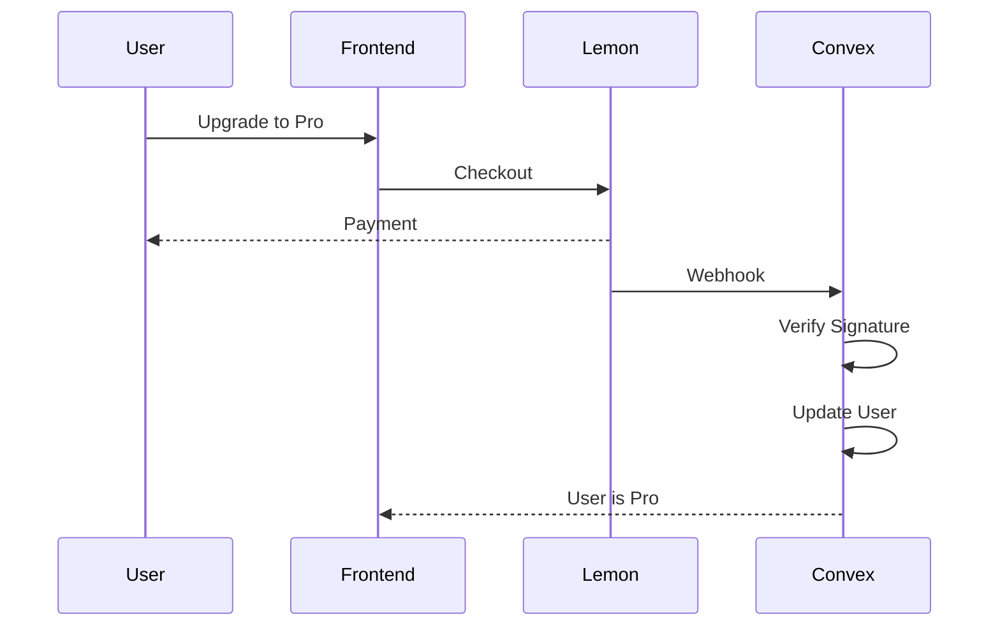
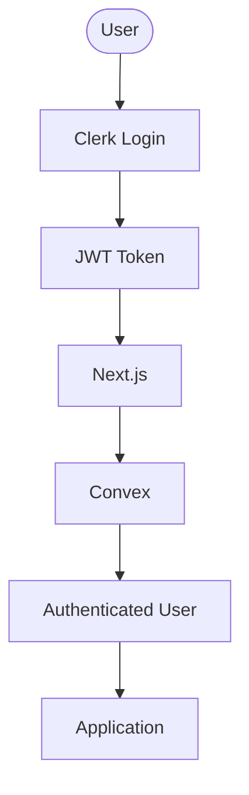
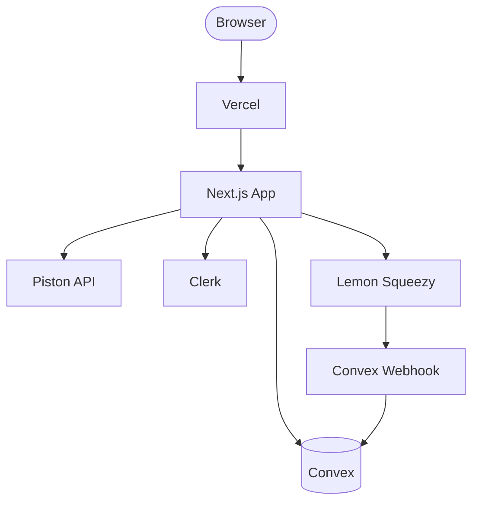

# 🚀 CodeSpaceEd - Online Collaborative Compiler

<p align="center">
  
  
  
  
  
  
  
  
  
</p>

---

## 📖 Overview

**CodeSpaceEd** is a modern cloud-based collaborative coding platform that enables developers to write, execute, and share code directly from the browser.

It combines a VS Code–like editing experience with real-time backend synchronization, premium subscriptions, community snippet sharing, and secure cloud execution powered by the **Piston API**.

---

## 🌟 Core Features
* **Multi-Language Code Execution:** Integrates the Piston API to compile and execute languages including Python, JavaScript, TypeScript, C++, Java, Rust, and Go directly from the browser.
* **Advanced Editor Interface:** Utilizes the Monaco Editor (`@monaco-editor/react`) to provide a VS Code-like experience with syntax highlighting, autocomplete, and customizable themes.
* **Community Snippet Sharing:** Users can publish their code, view snippets from others, leave comments, and star their favorite scripts in a dedicated community hub.
* **Premium Subscriptions:** Features a "Pro" tier integrated with Lemon Squeezy, allowing users to unlock premium functionalities via secure webhook-based payment verification.

## 🚀 Scalability & Backend Architecture
* **Convex Backend-as-a-Service:** Replaces a traditional REST API and database with Convex, providing real-time data synchronization, ACID-compliant transactions, and strict schema validation.
* **Clerk Authentication:** Offloads identity management to Clerk, seamlessly syncing user sessions with the Convex database using JWTs and webhook events.
* **Zustand State Management:** Handles complex client-side states (active language, theme selection, output results, and execution loading states) without unnecessary React re-renders.
* **HTTP Webhook Endpoints:** Convex exposes HTTP routes to securely catch async webhooks from external services like Lemon Squeezy to upgrade user profiles instantly.

---

# 🛠 Tech Stack

| Category | Technologies |
|-----------|--------------|
| Frontend | Next.js 15, React, TypeScript |
| Styling | Tailwind CSS |
| State Management | Zustand |
| Editor | Monaco Editor |
| Authentication | Clerk |
| Backend | Convex |
| Database | Convex Database |
| Code Execution | Piston API |
| Billing | Lemon Squeezy |
| Deployment | Vercel |

---

# 🏗 High Level Architecture



---

# 🔄 Request Lifecycle



---

# 🏛 System Components



---

# 🗂 Folder Structure

```text
CodeSpaceEd
│
├── app
├── components
├── convex
├── hooks
├── lib
├── providers
├── store
├── public
├── styles
├── types
├── utils
└── middleware.ts
```

---

# 🔄 Code Execution Flow



---

# 💳 Subscription Flow



---

# 🔐 Authentication Flow


---

# 🌍 Infrastructure



---

# ⚡ State Management

The application uses **Zustand** to manage

- Current Language
- Theme
- Font Size
- Code
- Console Output
- Loading State
- Execution Status
- User Preferences

---

# 🔒 Security

- Clerk Authentication
- JWT Validation
- Protected Convex Mutations
- Secure Lemon Squeezy Webhooks
- Sandboxed Code Execution
- Strict Database Schema Validation

---

# 📈 Scalability

The application is designed to scale horizontally.

- Stateless Next.js Frontend
- Real-time Convex Backend
- External Sandboxed Code Execution
- Event-driven Webhooks
- CDN-backed Asset Delivery
- Automatic Vercel Scaling
- Optimistic UI Updates
- ACID Transactions
- WebSocket Synchronization

---

# 🚀 Future Improvements

- Live Collaborative Coding
- Pair Programming
- Video Calling
- AI Code Assistant
- Code Review Suggestions
- Container-based Execution
- Team Workspaces
- Project Management
- Version Control
- Custom Themes

---

# 👨‍💻 Author

**Akshat Midha**

Built with ❤️ using

Next.js • React • TypeScript • Convex • Clerk • Monaco Editor • Zustand • Piston API • Lemon Squeezy

